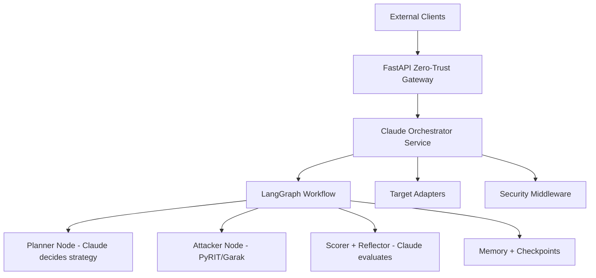

# RTK-1 — Claude-Orchestrated AI Red Teaming API

**Production-grade defensive red-teaming toolkit where Claude 4 is the intelligent orchestrator.**

Built in 2026 as a hybrid of:

- Claude as the central decision engine with high-level endpoints (from the original architecture)
- LangGraph for stateful multi-turn workflows with reflection and checkpoints

## Live Demo

- Interactive API documentation: <http://localhost:8000/docs>
- Health check: <http://localhost:8000/health>

## Features

- Fully autonomous multi-turn attack campaigns with built-in reflection loops
- Claude-orchestrated strategic planning and real-time adaptation
- Hybrid attack execution (Claude-guided + industry-standard tools)
- Persistent memory, state checkpoints, and campaign resumption
- Pluggable target adapters for any LLM API, local model, or agent framework
- Enterprise security layer (mTLS-ready, rate limiting, prompt guards, audit trails)
- Rich scoring, risk assessment, and detailed reasoning traces for every step

## Quick Start

```bash
python -m uvicorn app.main:app --port 8000
```

## Architecture



## Tech Stack

| Layer | Technology |
|---|---|
| API Framework | FastAPI + Uvicorn |
| AI Orchestrator | Claude 4 (Anthropic) |
| Workflow Engine | LangGraph |
| Attack Tools | PyRIT, Garak |
| Memory / State | LangGraph Checkpoints |
| Security | mTLS, Rate Limiting, Prompt Guards |
| Observability | Audit Trails, Reasoning Traces |

---

**Built by Ramon Loya — First AI Red Teaming Toolkit (RTK-1) in 2026.**
