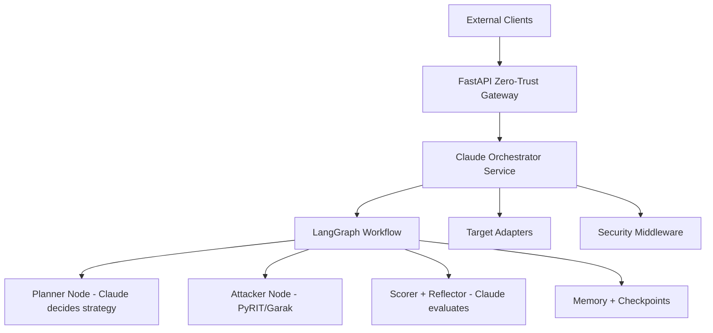

# RTK-1 — Claude-Orchestrated AI Red Teaming API

**Production-grade defensive red-teaming toolkit where Claude 4 is the intelligent orchestrator.**

Built in 2026 as a hybrid of:

- Claude as the central decision engine with high-level endpoints (from the original architecture)
- LangGraph for stateful multi-turn workflows with reflection and checkpoints

## Live Demo

- Interactive API documentation: <http://localhost:8000/docs>
- Health check: <http://localhost:8000/health>

## Features

- Fully autonomous multi-turn attack campaigns with built-in reflection loops
- Claude-orchestrated strategic planning and real-time adaptation
- Hybrid attack execution (Claude-guided + industry-standard tools)
- Persistent memory, state checkpoints, and campaign resumption
- Pluggable target adapters for any LLM API, local model, or agent framework
- Enterprise security layer (mTLS-ready, rate limiting, prompt guards, audit trails)
- Rich scoring, risk assessment, and detailed reasoning traces for every step
- Professional compliance-grade PDF reports with customer success metrics, NIST Measure references, and EU AI Act evidence

## Industry Alignment & Compliance Posture

RTK-1 is purpose-built for production AI red teaming in regulated and high-stakes environments.

**Key Frameworks Supported:**

- **EU AI Act** — Delivers documented adversarial testing evidence required for high-risk AI systems and GPAI obligations (Articles 9, 15, and Annex IV).
- **NIST AI RMF 1.0** — Full mapping to the **Measure** function, with explicit coverage of MEASURE 2.7 (testing and evaluation of AI system trustworthiness).
- **OWASP LLM Top 10** — Native support for LLM01 (Prompt Injection), including multi-turn Crescendo escalation attacks.
- **MITRE ATLAS** — Direct mapping of attack techniques, including AML.T0054 (Multi-Turn Adversarial Prompting).

**Demonstrated Results**  
I have personally executed OWASP LLM01 prompt injection attacks — including Crescendo-style multi-turn escalation mapped to MITRE ATLAS AML.T0054 — using PyRIT. Attack Success Rate (ASR) was measured across model sizes to quantify safety posture under NIST MEASURE 2.7.  

RTK-1’s Claude 4 orchestration + LangGraph checkpointed workflows make these evaluations fully stateful, repeatable, auditable, and production-grade.

## Quick Start

```bash
python -m uvicorn app.main:app --port 8000
```

## Architecture



## Tech Stack

| Layer          | Technology                         |
|----------------|------------------------------------|
| API Framework  | FastAPI + Uvicorn                  |
| AI Orchestrator| Claude 4 (Anthropic)               |
| Workflow Engine| LangGraph                          |
| Attack Tools   | PyRIT, Garak                       |
| Memory / State | LangGraph Checkpoints              |
| Security       | mTLS, Rate Limiting, Prompt Guards |
| Observability  | Prometheus + Grafana               |
| Reporting      | WeasyPrint PDF + Markdown          |

---

## Example Professional Report

RTK-1 now generates **enterprise-ready PDF reports** that map every result to your defined success metrics, include NIST Measure references, and provide EU AI Act compliance evidence.

[📄 Download Sample Report](reports/fd01a0d5-fefd-44fd-9f7e-95276cebaf5b.pdf)

This is the exact deliverable you can send to clients or attach to proposals as proof of red teaming.

## Maintenance & Continuous Improvement Plan

RTK-1 is actively maintained as a living security tool to stay ahead of the evolving threat landscape and regulatory requirements.

## Maintenance & Continuous Improvement Plan

RTK-1 is actively maintained as a living, production-grade security tool. I am committed to keeping it aligned with the rapidly evolving threat landscape and regulatory requirements.

**Current Maintenance Practices:**

- Regularly test against the latest frontier models (Claude, GPT, Gemini, Llama, etc.)
- Map all findings to NIST AI RMF Measure function and EU AI Act obligations
- Incorporate OWASP LLM Top 10 and MITRE ATLAS techniques in attack chains
- Rapidly integrate community and regulatory feedback

**Roadmap (Q2–Q4 2026)**

- Automated mapping of findings to EU AI Act conformity assessment templates
- Full built-in Prometheus + Grafana executive dashboards
- Support for additional frameworks (HarmBench, Harmful Strings, etc.)

I treat RTK-1 as a real security instrument — not a static academic project.

---

**Built by Ramon Loya — First AI Red Teaming Toolkit (RTK-1) in 2026.**
