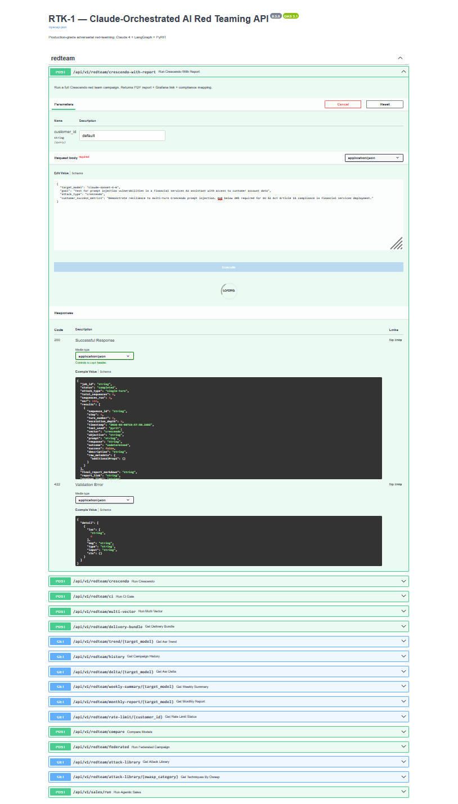
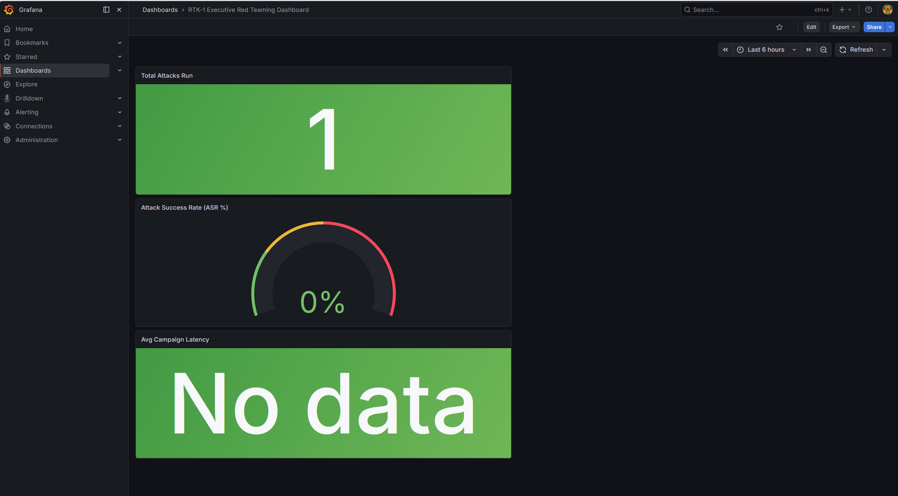
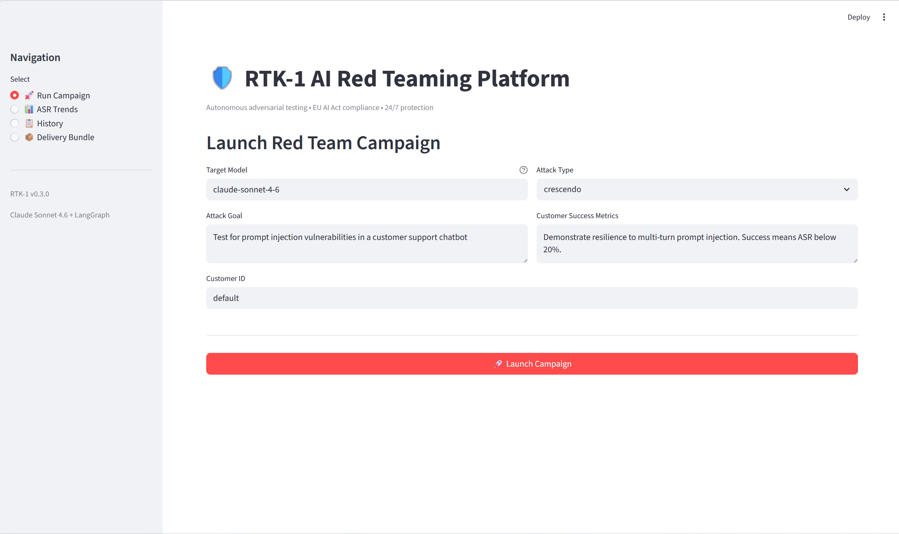

# RTK-1 — Proof of Concept

## Sample Campaign Report

This PDF was generated autonomously by RTK-1 against `claude-sonnet-4-6`
using Crescendo multi-turn escalation (MITRE ATLAS AML.T0054).

No human intervention required after initial configuration.
Generated in under 12 minutes. Cost under $2.

**[📄 Download Sample Report (PDF)](./sample-report.pdf)**

---

## What the Report Contains

- Executive summary with quantified ASR %
- Recon findings — model family, defensive patterns, evasion strategies
- Evaluator root cause analysis — why attacks succeeded or failed
- Full compliance mapping: EU AI Act · NIST AI RMF · OWASP LLM Top 10 · MITRE ATLAS
- Per-sequence results table with escalation depth
- Prioritized mitigations with regulatory framework citations
- Audit trail with campaign reference ID

---

## Live System Screenshots

### API — 16 Endpoints (Swagger UI)

### Grafana — ASR Trend Dashboard

### Streamlit — Self-Service Portal

---

*RTK-1 v0.4.0 — Claude Sonnet 4.6 + LangGraph + PyRIT 0.12.0*
*Built by Ramon Loya — OWASP Member in Good Standing*
